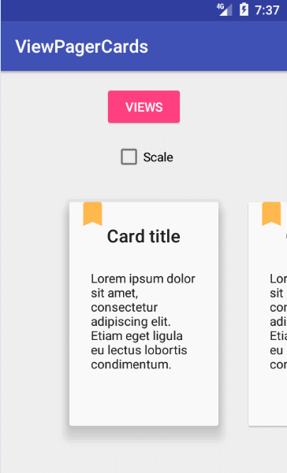

# ViewPagerCards
---
* 欢迎关注微信公众号、长期为您推荐优秀博文、开源项目、视频

* 微信公众号名称：Android干货程序员

* 

* 项目总贴:https://github.com/open-android/Android


</img> </img>




## 使用步骤：
### 第一步：初始化ViewPager：
```
<android.support.v4.view.ViewPager
        android:id="@+id/viewPager"
        android:layout_width="match_parent"
        android:layout_height="330dp"
        android:layout_gravity="bottom"
        android:clipToPadding="false"
        android:overScrollMode="never"
        android:paddingBottom="30dp"
        android:paddingEnd="@dimen/card_padding"
        android:paddingLeft="@dimen/card_padding"
        android:paddingRight="@dimen/card_padding"
        android:paddingStart="@dimen/card_padding" />
```

### 第二步：设置setPageTransformer：
```
public class ShadowTransformer implements ViewPager.OnPageChangeListener, ViewPager.PageTransformer {

    private ViewPager mViewPager;
    private CardAdapter mAdapter;
    private float mLastOffset;
    private boolean mScalingEnabled;

    public ShadowTransformer(ViewPager viewPager, CardAdapter adapter) {
        mViewPager = viewPager;
        viewPager.addOnPageChangeListener(this);
        mAdapter = adapter;
    }

    public void enableScaling(boolean enable) {
        if (mScalingEnabled && !enable) {
            // shrink main card
            CardView currentCard = mAdapter.getCardViewAt(mViewPager.getCurrentItem());
            if (currentCard != null) {
                currentCard.animate().scaleY(1);
                currentCard.animate().scaleX(1);
            }
        }else if(!mScalingEnabled && enable){
            // grow main card
            CardView currentCard = mAdapter.getCardViewAt(mViewPager.getCurrentItem());
            if (currentCard != null) {
                currentCard.animate().scaleY(1.1f);
                currentCard.animate().scaleX(1.1f);
            }
        }

        mScalingEnabled = enable;
    }

    @Override
    public void transformPage(View page, float position) {

    }

    @Override
    public void onPageScrolled(int position, float positionOffset, int positionOffsetPixels) {
        int realCurrentPosition;
        int nextPosition;
        float baseElevation = mAdapter.getBaseElevation();
        float realOffset;
        boolean goingLeft = mLastOffset > positionOffset;

        // If we're going backwards, onPageScrolled receives the last position
        // instead of the current one
        if (goingLeft) {
            realCurrentPosition = position + 1;
            nextPosition = position;
            realOffset = 1 - positionOffset;
        } else {
            nextPosition = position + 1;
            realCurrentPosition = position;
            realOffset = positionOffset;
        }

        // Avoid crash on overscroll
        if (nextPosition > mAdapter.getCount() - 1
                || realCurrentPosition > mAdapter.getCount() - 1) {
            return;
        }

        CardView currentCard = mAdapter.getCardViewAt(realCurrentPosition);

        // This might be null if a fragment is being used
        // and the views weren't created yet
        if (currentCard != null) {
            if (mScalingEnabled) {
                currentCard.setScaleX((float) (1 + 0.1 * (1 - realOffset)));
                currentCard.setScaleY((float) (1 + 0.1 * (1 - realOffset)));
            }
            currentCard.setCardElevation((baseElevation + baseElevation
                    * (CardAdapter.MAX_ELEVATION_FACTOR - 1) * (1 - realOffset)));
        }

        CardView nextCard = mAdapter.getCardViewAt(nextPosition);

        // We might be scrolling fast enough so that the next (or previous) card
        // was already destroyed or a fragment might not have been created yet
        if (nextCard != null) {
            if (mScalingEnabled) {
                nextCard.setScaleX((float) (1 + 0.1 * (realOffset)));
                nextCard.setScaleY((float) (1 + 0.1 * (realOffset)));
            }
            nextCard.setCardElevation((baseElevation + baseElevation
                    * (CardAdapter.MAX_ELEVATION_FACTOR - 1) * (realOffset)));
        }

        mLastOffset = positionOffset;
    }

    @Override
    public void onPageSelected(int position) {

    }

    @Override
    public void onPageScrollStateChanged(int state) {

    }
}
```
### 第三步：设置setAdapter：
```
public class CardFragmentPagerAdapter extends FragmentStatePagerAdapter implements CardAdapter {

    private List<CardFragment> mFragments;
    private float mBaseElevation;

    public CardFragmentPagerAdapter(FragmentManager fm, float baseElevation) {
        super(fm);
        mFragments = new ArrayList<>();
        mBaseElevation = baseElevation;

        for(int i = 0; i< 5; i++){
            addCardFragment(new CardFragment());
        }
    }

    @Override
    public float getBaseElevation() {
        return mBaseElevation;
    }

    @Override
    public CardView getCardViewAt(int position) {
        return mFragments.get(position).getCardView();
    }

    @Override
    public int getCount() {
        return mFragments.size();
    }

    @Override
    public Fragment getItem(int position) {
        return mFragments.get(position);
    }

    @Override
    public Object instantiateItem(ViewGroup container, int position) {
        Object fragment = super.instantiateItem(container, position);
        mFragments.set(position, (CardFragment) fragment);
        return fragment;
    }

    public void addCardFragment(CardFragment fragment) {
        mFragments.add(fragment);
    }

}
```
### 第四步：设置CardAdapter：
```
public interface CardAdapter {

    int MAX_ELEVATION_FACTOR = 8;

    float getBaseElevation();

    CardView getCardViewAt(int position);

    int getCount();
}
```
### 第五步：实现：
```
mViewPager.setAdapter(mFragmentCardAdapter);
mViewPager.setPageTransformer(false, mFragmentCardShadowTransformer);
```
